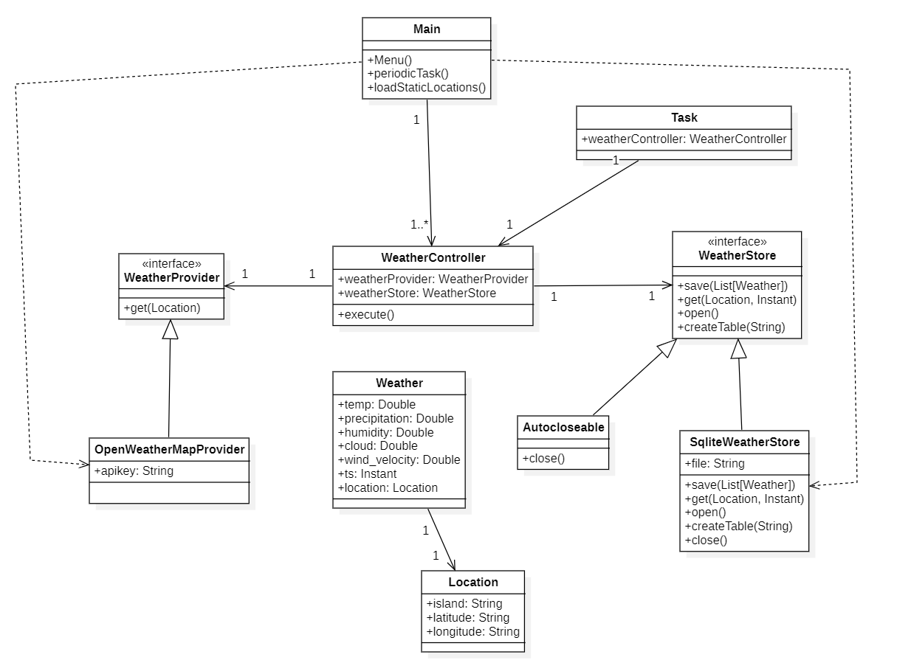

# Weather App
Desarrollo de aplicaciones para ciencia de datos  
2 Año de carrera - 1 Cuatrimestre  
Grado en Ciencia e Ingeniería de Datos  
Escuela Universitaria de Informática  
Universidad de Las Palmas de Gran Canaria  
## Resumen
El objetivo de este proyecto es desarrollar una aplicación que permita obtener información meteorológica de una ciudad. Para ello, se ha utilizado la API de OpenWeatherMap, que permite obtener información meteorológica de cualquier ciudad del mundo.

Además, esta información se almacena en una base de datos SQLite para su consulta a posterior y se muestra en una CLI.

## Recursos
- [OpenWeatherMap](https://openweathermap.org/)
- [SQLite](https://www.sqlite.org/index.html)
- [Java](https://www.java.com/es/)
- [Maven](https://maven.apache.org/)
- [JDBC](https://www.oracle.com/java/technologies/javase/jdbc.html)
- [IntelliJ IDEA](https://www.jetbrains.com/es-es/idea/)
- [Git](https://git-scm.com/)
- [GitHub](https://github.com/)
- [Markdown](https://www.markdownguide.org/)
- [StarUML](https://staruml.io/)

## Diseño
Esta aplicación consta de un paquete `control` con las siguientes clases:
- `WeatherController`: Clase principal que contiene el método `execute` y que se encarga de gestionar la ejecución del programa.
- `WeatherProvider`: Interfaz que se encarga de definir los métodos que utilizaran las implementaciones para recoger los datos meteorológicos de las posibles APIs, esta interfaz añade los métodos `get`.
- `WeatherStore`: Interfaz que se encarga de definir los métodos que utilizaran las implementaciones para almacenar los datos meteorológicos en las posibles bases de datos, esta interfaz añade los métodos `save`, `get`, `open` y `createTable`.
- `OpenWeatherMapProvider`: Clase que implementa la interfaz `WeatherProvider` y que se encarga de recoger los datos meteorológicos de la API de OpenWeatherMap.
- `SQLiteWeatherStore`: Clase que implementa la interfaz `WeatherStore` y que se encarga de almacenar los datos meteorológicos en una base de datos SQLite.
- `Task`: Clase que se encarga de gestionar las tareas que se ejecutan en segundo plano, esta clase añade los métodos `execute`.

También tenemos un paquete `model` con las siguientes clases:
- `Weather`: Clase que se encarga de almacenar los datos meteorológicos de una ciudad.
- `Location`: Clase que se encarga de almacenar los datos de una localización.

Y un paquete `locations` donde tenemos un archivo `locations.csv` con las localizaciones de las ciudades que se van a utilizar en la aplicación.

También tenemos el main en el cual inicializaremos todas las anteriores clases y cargaremos los ficheros necesarios para la ejecución del programa y le pasaremos por argumentos la apikey de OpenWeatherMap, el path de la base de datos y el path del fichero de las localizaciones.

### Diagrama de clases

## Ejecución
Para ejecutar la aplicación tenemos que pasarle por argumentos al `main` la apikey de OpenWeatherMap, el path de la base de datos y el path del fichero de las localizaciones.

Después de esto nos aparecerá un menú con las siguientes opciones:
- `1. Activate the APP to collect DATA`: Esta opción pone a funcionar el programa activando la periodicidad de las tareas.
- `2. Check predictions`: Esta opción nos muestra una predicción de un día concreto de una ciudad concreta.